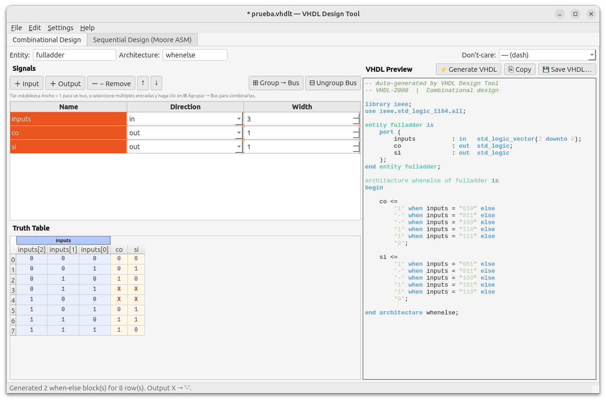
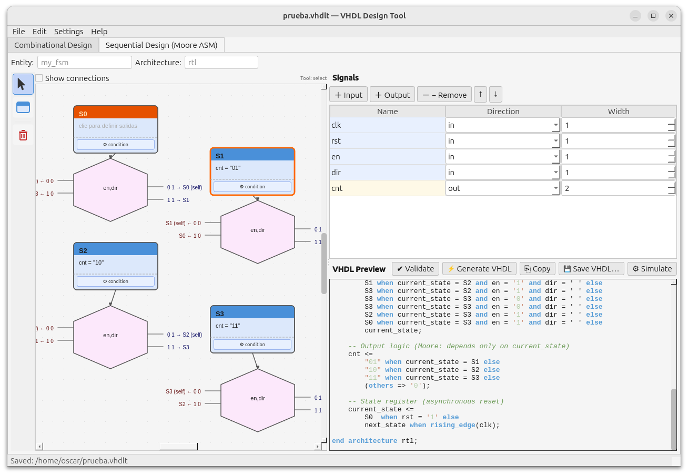
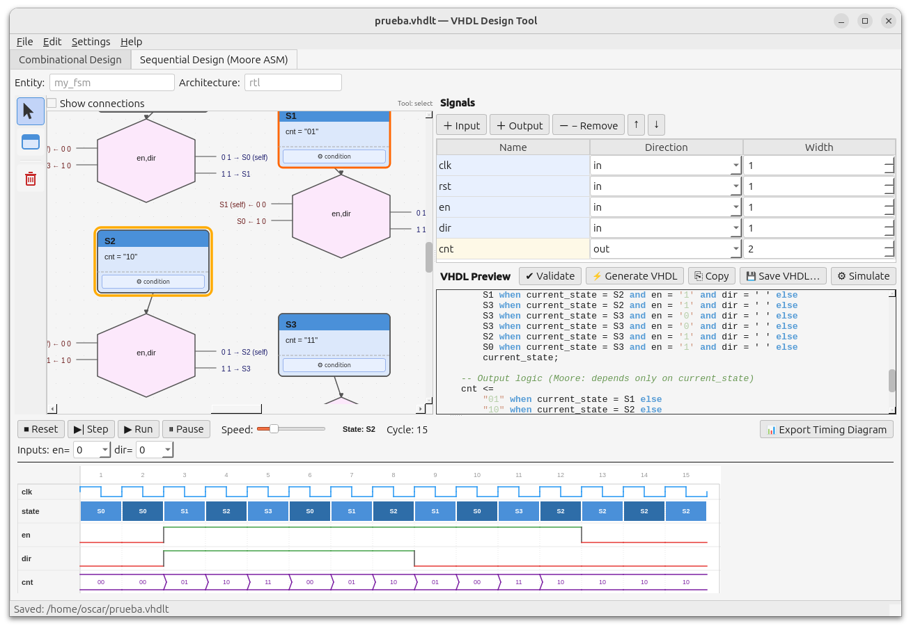
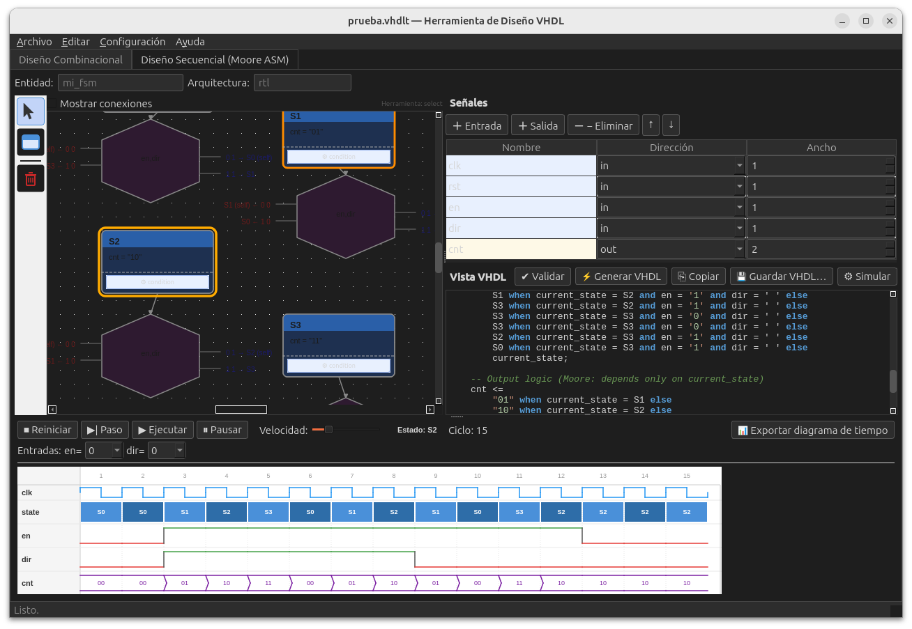
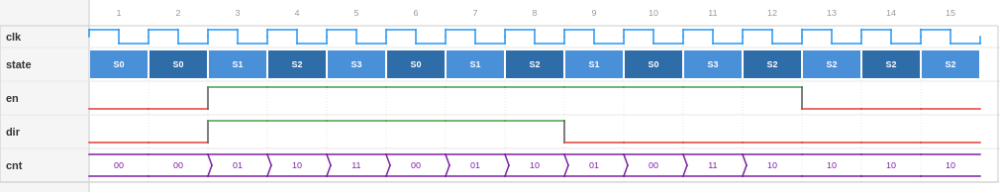

# VHDL Design Tool

A free, open-source desktop application for digital design education. Draw combinational logic truth tables and Moore FSM ASM charts, generate correct VHDL-2008, simulate your design live, and export timing diagrams — all in one tool.

Built with Python 3.10+ and PyQt6.

---

## 📸 Screenshots

### Combinational Design — Truth Table Editor


### Sequential Design — Moore ASM Chart


### FSM Simulation — Live Timing Diagram


### Dark Mode + Spanish Interface


### Timing Diagram Export


---

## ✨ Features

### Combinational Design
- Signal manager with scalar and bus (`std_logic_vector`) support
- Interactive truth table editor with don't-care support (`-`, `0`, `1`)
- Bus grouping / ungrouping
- One-click VHDL-2008 generation (concurrent `when-else`, no processes)

### Sequential Design (Moore ASM)
- Visual ASM chart canvas — place states, connect transitions
- Three transition types: **Unconditional**, **Diamond** (single input), **Hexagon** (multi-input)
- Bus-aware hexagon condition minterms
- Moore output assignment via dialog (checkboxes for scalars, text for buses)
- Initial state marking with amber header
- ASM validation with errors and warnings before generation
- VHDL-2008 generation: three concurrent `when-else` statements, no processes

### Simulation
- Cycle-by-cycle stepping or continuous run with adjustable speed
- **Live timing diagram** — logic-analyzer style waveform that updates in real time
- Amber glow ring highlights the current state on the canvas
- Input controls (dropdowns for scalars, text fields for buses) between steps
- Export timing diagram as PNG

### General
- Project save / load (`.vhdlt` JSON format)
- Dark mode — instant toggle, persisted across sessions
- Bilingual — English 🇺🇸 / Spanish 🇪🇸, runtime switching, persisted
- Dirty tracking — window title shows `*` for unsaved changes

---

## 🚀 Getting Started

### Requirements

- Python 3.10 or later
- PyQt6

### Installation

```bash
# Clone the repository
git clone https://github.com/YOUR_USERNAME/vhdl-tool.git
cd vhdl-tool

# Create a virtual environment (recommended)
python -m venv venv
source venv/bin/activate      # Linux / macOS
venv\Scripts\activate         # Windows

# Install dependencies
pip install -r requirements.txt

# Run the app
python main.py
```

### Dependencies

```
PyQt6>=6.4.0
```

---

## 📖 User Guide

### Combinational Design

#### 1. Define your signals
In the **Signals** panel on the left, click **+ Input** or **+ Output** to add signals.
Set the **Width** to `1` for a single `std_logic` bit, or greater than `1` for a `std_logic_vector` bus.

For buses, you can also select multiple scalar input signals and click **⊞ Group → Bus** to merge them into a single vector.

#### 2. Fill in the truth table
The truth table is generated automatically from your input signals — one row per input combination. Click any cell in an **output column** to cycle through `0`, `1`, and `X` (don't-care).

Use the **Don't-care output generates** dropdown in the toolbar to control how `X` values are emitted in the VHDL:
- `—` (dash) — synthesiser choice (`'-'`)
- `1` — cover the minterm
- `0` — don't cover

#### 3. Generate VHDL
Set the **Entity** and **Architecture** names in the toolbar, then click **⚡ Generate**. The VHDL-2008 preview appears on the right. Click **⎘ Copy** to copy to clipboard or **💾 Save .vhd** to save to a file.

The generated architecture uses one concurrent `when-else` statement per output signal — no processes, fully synthesisable.

---

### Sequential Design (Moore ASM)

#### 1. Define your signals
Add signals in the **Signals** panel on the right:
- `clk` and `rst` — clock and reset (added by default)
- Input signals — the FSM's condition inputs (e.g. `x`)
- Output signals — the Moore outputs (e.g. `z`)

#### 2. Place state blocks
Select the **Place State** tool in the toolbar and click on the canvas to place a state. Each state block has:
- An **editable name** at the top (click to rename)
- An **output area** in the middle (click to open the output assignment dialog)
- A **＋ condition** button at the bottom

**Double-click** or right-click a state to mark it as the **initial state** — its header turns amber.

#### 3. Assign outputs
Click the output area of a state to open the **Outputs** dialog:
- **Tick a checkbox** to assert a scalar output (`'1'`) in that state
- **Type a bit pattern** (e.g. `101`) for a bus output
- Unticked / empty signals default to `'0'`

#### 4. Add transitions
Click the **＋ condition** button on a state to add a transition. Choose from:

| Type | When to use |
|---|---|
| **Unconditional** | The state always goes to the next state |
| **Single input (Diamond)** | Transition depends on one 1-bit signal |
| **Multiple inputs (Hexagon)** | Transition depends on multiple signals or a bus |

A condition block appears snapped below the state, connected by an arrow. Moving the state moves the condition block with it.

To **edit** or **remove** a condition, click the **⚙ condition** button on the state.

**Diamond** exits: Y → (condition true) and N ↓ (condition false), each pointing to a target state.

**Hexagon** exits: one exit per minterm (or custom labels), distributed alternately on the left and right sides. The number of exits is inferred automatically from the variable widths — a 2-bit bus generates 4 exits, two 1-bit signals also generate 4 exits.

**Tip:** A state with no condition block is a dead end — the validator will warn you.

#### 5. Validate and generate VHDL
Click **✔ Validate** to check your design. Errors (red) must be fixed before generating. Warnings (amber) are informational.

Click **⚡ Generate** to produce VHDL-2008. The architecture uses:
- One `when-else` for next-state logic (failsafe: `current_state`)
- One `when-else` per output signal (Moore: depends only on current state)
- One `when-else` for the state register (async reset + rising edge clock)

---

### Simulation

#### 1. Start the simulation
Click **⚙ Simulate** in the toolbar. The tool validates the ASM chart first — if there are errors, it will report them and refuse to start.

The **simulation panel** slides in at the bottom of the window showing:
- **Control bar** — Reset, Step, Run, Pause, speed slider
- **Input controls** — one dropdown per 1-bit input, one text field per bus
- **Live timing diagram** — clock, state, inputs, and outputs update with every cycle

#### 2. Step through cycles
- **▶| Step** — advance one clock cycle using the current input values
- **▶ Run** — run continuously; use the speed slider to control pace
- **⏸ Pause** — pause a running simulation
- **⏹ Reset** — return to the initial state and clear the diagram

Change input values between steps to explore different paths through the FSM.

#### 3. Read the timing diagram
The live diagram shows:
- **clk** — always-toggling clock lane
- **state** — coloured boxes per cycle showing the active state name
- **inputs** — green/red square waves for 1-bit signals; purple parallel lines for buses
- **outputs** — same style as inputs

The **current state** on the canvas is highlighted with an amber glow ring.

#### 4. Export the timing diagram
Click **📊 Export Timing Diagram** to save the current waveform as a PNG — ready for lab reports or course materials.

---

### Project Files

Use **File → Save Project** (`Ctrl+S`) to save your work as a `.vhdlt` file (JSON format). This saves both the combinational and sequential designs together.

The window title shows `*` when there are unsaved changes, and the app will prompt you to save before closing or opening another project.

---

### Settings

Access **Settings → Language** to switch between **English** and **Español** at any time — no restart needed.

Access **Settings → Theme** to switch between **Light** and **Dark** mode — also instant, no restart.

Both settings are remembered across sessions.

---

## 📁 Project Structure

```
vhdl_tool/
├── main.py                          # Entry point
├── main_window.py                   # MainWindow, menus, project I/O, i18n
├── requirements.txt
│
├── ui/                              # Qt Designer .ui files
│   ├── main_window.ui
│   ├── combinational_tab.ui
│   └── sequential_tab.ui
│
├── widgets/                         # PyQt6 widget classes
│   ├── combinational_widget.py
│   ├── sequential_widget.py
│   ├── signal_manager_widget.py
│   ├── truth_table_widget.py
│   ├── asm_canvas_widget.py         # QGraphicsScene/View canvas
│   ├── asm_items.py                 # StateItem, DiamondItem, HexagonItem, …
│   ├── asm_toolbar.py
│   ├── vhdl_preview_widget.py
│   ├── simulation_panel.py          # Live simulation panel
│   ├── timing_diagram_widget.py     # Live waveform widget
│   ├── condition_dialog.py
│   └── state_output_dialog.py
│
├── models/                          # Data models
│   ├── signal_model.py
│   └── truth_table_model.py
│
├── generators/                      # VHDL code generators
│   ├── combinational_vhdl.py
│   ├── sequential_vhdl.py
│   └── asm_validator.py
│
├── simulation/                      # FSM simulation engine
│   ├── fsm_engine.py
│   └── timing_diagram.py
│
├── project/                         # Save / load
│   ├── project_manager.py
│   └── dirty_tracker.py
│
└── i18n/                            # Internationalisation
    ├── __init__.py                  # tr(), set_language(), set_theme()
    ├── en.py                        # English strings
    ├── es.py                        # Spanish strings
    └── themes.py                    # Light / Dark colour tokens
```

---

## 🎓 Classroom Use

This tool was designed for digital design courses. Students can:

1. **Design** combinational circuits using the truth table editor
2. **Design** Moore FSMs using the visual ASM chart editor
3. **Validate** their design before generating VHDL
4. **Generate** synthesisable VHDL-2008 with one click
5. **Simulate** the FSM step by step, watching states transition live
6. **Export** a timing diagram PNG for lab reports

Project files (`.vhdlt`) can be submitted as assignments and opened by the instructor for review.

---

## 🗺️ Roadmap

- [ ] Mealy FSM support
- [ ] VHDL testbench generator from simulation trace
- [ ] More languages (French, Portuguese, …)
- [ ] State machine import from VHDL
- [ ] Simulation breakpoints and input scripting

---

## 🤝 Contributing

Contributions are welcome! Please open an issue to discuss what you'd like to change before submitting a pull request.

1. Fork the repository
2. Create a feature branch (`git checkout -b feature/my-feature`)
3. Commit your changes (`git commit -m 'Add my feature'`)
4. Push to the branch (`git push origin feature/my-feature`)
5. Open a Pull Request

See [CONTRIBUTING.md](CONTRIBUTING.md) for full details.

---

## 📄 License

This project is licensed under the **GNU General Public License v3.0** — see the [LICENSE](LICENSE) file for details.

This means you are free to use, study, modify and distribute this software, provided that any derivative works are also distributed under the same GPL-3 license.

[](https://www.gnu.org/licenses/gpl-3.0)

---

## 🙏 Acknowledgements

Built with [PyQt6](https://www.riverbankcomputing.com/software/pyqt/) — Python bindings for the Qt framework.
